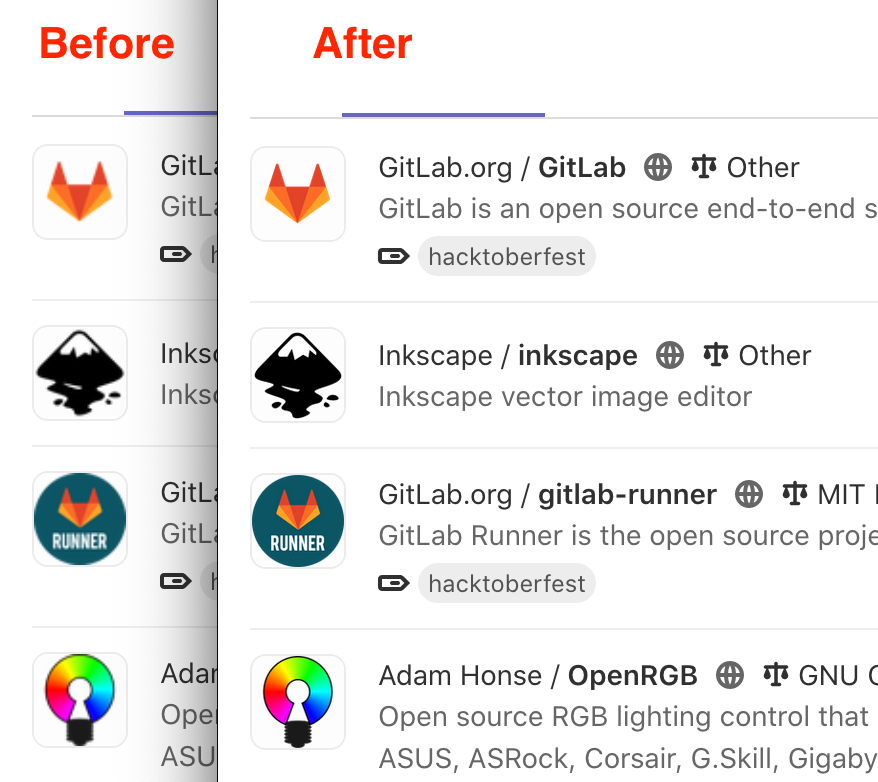

GitLab for Retina monitors
==========================

Improves the look of project and user icons in GitLab for users of Retina monitors.
It finds avatar images in GitLab pages and provides the browser with an optional higher-resolution version of them.

[Gitlab Issue #345020](https://gitlab.com/gitlab-org/gitlab/-/issues/345020)

Installation
------------

### [Firefox Addons](https://addons.mozilla.org/en-US/firefox/addon/gitlab-sharp-avatars/)

### [Chrome Web Store](https://chrome.google.com/webstore/detail/gitlab-sharp-avatars/dilgopjfchgkenadmoapgbcphcoejfff)

Screenshot
----------

